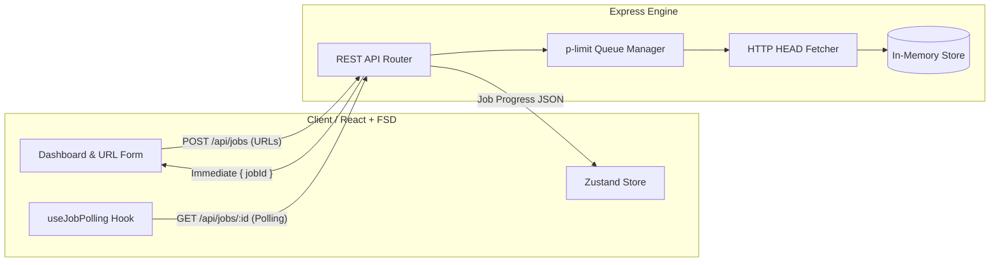

# 🚀 Async URL Checker

*A hyper-clean, high-performance asynchronous URL status verification engine & dashboard built with React, Express, Zustand, and TypeScript.*


---

## 🎨 Design Philosophy & Architecture

### Minimalist UI & FSD Philosophy
Built following **Feature-Sliced Design (FSD)** principles, **Async URL Checker** combines production-grade frontend architecture with a clean, distraction-free interface.
- **Zero Background Noise:** Content-first dashboard focused purely on execution metrics and real-time status tracking.
- **Real-Time Polling Dashboard:** Instant visual feedback with strict cleanup flags to eliminate stale states.
- **FSD Architecture:** Clean layer separation (`app`, `widgets`, `features`, `entities`, `shared`) ensuring modularity and maintainability.

---

## ⚙️ System Architecture



---

## 🚀 Features
- **True Asynchronous Processing:** Jobs are queued and run strictly in the background using `p-limit` for a maximum of 5 concurrent URL checks per job.
- **Race Condition Immunity:** Carefully designed React hooks and Zustand stores ensure no overlapping intervals or zombie polling states.
- **Artificial Delay & Timeout:** Enforces 0-10s randomized delays via `Math.random()` and strict 5-second `axios` timeouts to prevent hanging domains.
- **Job Cancellation:** Instantly halt in-progress background queues safely, leaving processed items intact and terminating pending URLs.

---

## 🛠 Local Setup

**Requirements:** Node.js v20+

1. **Clone the repository:**
   ```bash
   git clone https://github.com/komilolimov/32-05.git
   cd 32-05
   ```

2. **Run Backend:**
   ```bash
   cd backend
   npm install
   npm run build
   npm start
   # Runs on http://localhost:3001
   ```

3. **Run Frontend:**
   ```bash
   cd frontend
   npm install
   npm run dev
   # Runs on http://localhost:5173
   ```

---

## 🐳 Docker Deployment
Fully configured for production environments via multi-stage Docker builds and an Nginx proxy.

```bash
# Build and start services in detached mode
docker-compose up -d --build
```
- The Dashboard will be accessible at `http://localhost:3001`
- The API is proxied seamlessly via `Nginx` behind the scenes.

---

## 📡 Core API Reference

- `POST /api/jobs` - Create a new check job with a JSON payload `{ "urls": ["..."] }`. Returns `{ "jobId": "..." }` instantly.
- `GET /api/jobs` - Retrieve all job histories and metadata summaries.
- `GET /api/jobs/:id` - Fetch detailed execution stats, statuses, duration, and error messages for a specific job.
- `DELETE /api/jobs/:id` - Force cancel a running job queue.

---

## 🧪 Testing
Includes high-coverage integration tests built on **Vitest**, specifically targeting race conditions and cancellation behaviors.

```bash
cd frontend
npm test
```
